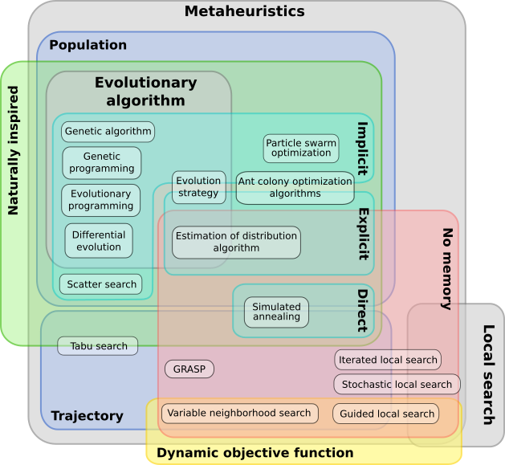
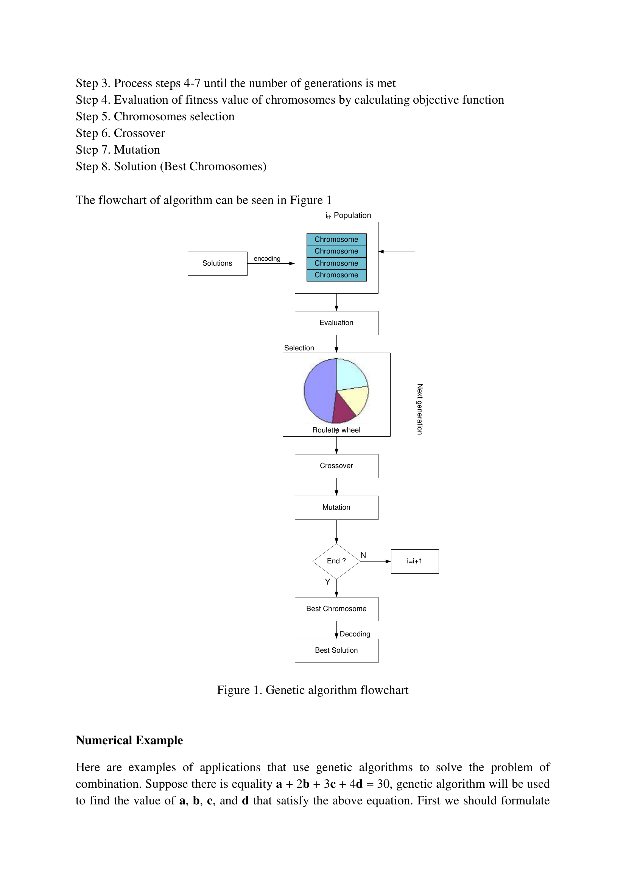
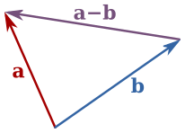

  
Metaheuristics

  <h1>Search, when the search space is too large for brute force</h1>
  
10100 solutions. You can test 109. What do you do?

  
10100

  
States in a typical search space

  
More than atoms in the observable universe. Brute force is not an option.

---

  
01 / The Scale

  <h1>A needle in a universe-sized haystack</h1>
  
TSP with 50 cities: ~1064 routes. Branch-and-bound at 109 routes/sec: 1047 years.

  

    
The best we can hope for is <b>good enough, fast enough</b>.

  

  

    

      
TSP scaling

      
10 cities → 3.6 × 106 routes

      
20 cities → 1.2 × 1018 routes

      
50 cities → 3.0 × 1064 routes

    

  

  

    
Exact optimization is tractable for n &lt; ~20. Beyond that, we need heuristics.

  

---

  
02 / The Naive Approach

  <h1>Hill climbing: always go uphill</h1>
  
Pick a random point. Move to a neighbor if it improves the objective. Repeat until stuck.

  

    
Hill climbing

    
x ← random()

    
<b>repeat</b>:

    
x' ← neighbor(x)

    
<b>if</b> f(x') > f(x):

    
x ← x'

    
<b>until</b> converged

  

  
Local

  
Hill climbing finds the nearest optimum

  
If you start near a local peak, you climb it. You never see the taller peak across the valley because going downhill is disallowed.

  

    
The algorithm has no mechanism to escape local optima. It converges to whatever attractor basin it lands in.

  

---

  
03 / The Landscape

  <h1>A landscape is a function f: X → ℝ</h1>
  
Each point in the search space has a fitness. Optimization algorithms are walkers on this terrain. They need a strategy to find the highest peak.

  

    
Goldstein-Price function shown. One global minimum (f = 3), three local minima.

  

  <DPSearchLandscape />

---

  
04 / No Free Lunch

  <h1>No algorithm dominates</h1>
  
Averaged over all possible problems, every search algorithm performs the same as random search.

  
The NFL theorem (Wolpert & Macready, 1997)

  

    $$ \sum_{P \in \mathcal{P}} \mathbb{E}[f(A, P)] = \text{const} \quad \forall A $$
  

  
Any algorithm's wins on some problems are exactly balanced by its losses on others.

  <DPNFLBars />
  
Performance of algorithm A across six problem classes. The red line is the average — same for all algorithms.

---

  
05 / The Menagerie

  <h1>Metaheuristics are strategies, not formulas</h1>
  
They trade guarantees for generality. No optimality proof. No runtime bound. In exchange: they work on problems where exact methods cannot even start.

  

---

  
06 / The Central Trade-off

  <h1>Explore vs Exploit</h1>
  
Every metaheuristic allocates budget between exploring new regions and refining known good ones.

  <DPSearchLandscape showExploration />

  

    
Exploitation

    
Refine the current best. Local search around promising regions.

  

  

    
Exploration

    
Search broadly. Visit distant regions to find new attractor basins.

  

---

  
07 / Simulated Annealing

  <h1>Escaping local optima by controlled randomness</h1>
  
SA accepts worse solutions with probability $$P = e^{-\Delta / T}$$. Temperature T starts high (lots of exploration) and cools toward zero (pure exploitation).

  

    
If T cools slowly enough, SA is guaranteed to find the global optimum (with probability → 1 as time → ∞).

  

  <DPSearchLandscape showSATrajectory />
  
Red path: SA trajectory. Early steps jump freely; later steps converge to the global basin.

---

  
08 / Cooling Schedules

  <h1>How fast to cool determines success</h1>
  
The cooling schedule is the algorithm. Too fast — freeze into a local optimum. Too slow — waste evaluations.

  
Acceptance probability

  

    $$ P(\text{accept}) = \min\left(1,\; e^{-\Delta / T}\right) $$
  

  

    
Common schedules

    

      $$ T_k = T_0 \cdot \alpha^k \quad (\text{exponential}) $$
      $$ T_k = T_0 / \log(k + 1) \quad (\text{logarithmic}) $$
      $$ T_k = T_0 \cdot (1 - k/K) \quad (\text{linear}) $$
    

  

  
Hajek's condition for convergence

  

    $$ \sum_{k=1}^{\infty} e^{-\delta / T_k} = \infty $$
  

  
If the cooling schedule satisfies this, SA converges to the global optimum with probability 1. Logarithmic cooling satisfies it. Exponential does not.

---

  
09 / Genetic Algorithm

  <h1>Breeding solutions through selection, crossover, and mutation</h1>
  
A population of candidate solutions evolves. Fit individuals reproduce. Their offspring inherit traits from both parents, plus random mutations.

  <DPSearchLandscape showGAPopulation />
  
Grey dots: population individuals spread across the landscape, concentrated in promising basins.

---

  
10 / GA Flow

  <h1>Selection, crossover, mutation — repeat</h1>
  
A single iteration cycle: evaluate fitness, select parents, produce offspring, mutate, replace.

  

---

  
11 / Schema Theorem

  <h1>Building blocks of good solutions grow exponentially</h1>
  
Holland's schema theorem: short, low-order schemata with above-average fitness receive exponentially increasing trials in subsequent generations.

  
Expected number of schema H copies at generation t+1

  

    $$ \mathbb{E}[m(H, t+1)] \geq m(H, t) \cdot \frac{\hat{f}(H, t)}{\bar{f}(t)} \cdot \left(1 - p_c \cdot \frac{\delta(H)}{L-1} - p_m \cdot o(H)\right) $$
  

  

    <table style="font-size:12px;width:100%;">
      <tbody>
      <tr><td style="padding:4px 8px;"><b>m(H, t)</b></td><td>number of schema H instances at generation t</td></tr>
      <tr><td style="padding:4px 8px;"><b>f̂(H, t)</b></td><td>average fitness of schema H</td></tr>
      <tr><td style="padding:4px 8px;"><b>f̄(t)</b></td><td>average population fitness</td></tr>
      <tr><td style="padding:4px 8px;"><b>δ(H)</b></td><td>defining length of schema</td></tr>
      <tr><td style="padding:4px 8px;"><b>o(H)</b></td><td>order (fixed positions) of schema</td></tr>
      </tbody>
    </table>
  

---

  
12 / Particle Swarm

  <h1>Collective intelligence through velocity updates</h1>
  
Each particle remembers its best-known position and the swarm's global best. Velocity blends personal history, social influence, and inertia.

  

    
No crossover. No selection. Just three weighted forces pulling each particle through the space.

  

  <DPSearchLandscape showPSOSwarm />
  
Red dots: particles with velocity vectors pointing toward their personal + global best.

---

  
13 / PSO Velocity

  <h1>Three forces, one update rule</h1>
  
Inertia keeps the particle moving. Cognitive component pulls it toward its own best. Social component pulls it toward the swarm's best.

  

    $$ v_{i}(t+1) = w \cdot v_{i}(t) + c_1 r_1 (p_i - x_i(t)) + c_2 r_2 (g - x_i(t)) $$
  

  

    $$ x_{i}(t+1) = x_{i}(t) + v_{i}(t+1) $$
  

  

    <table style="font-size:12px;width:100%;">
      <tbody>
      <tr><td style="padding:2px 8px;">w</td><td>inertia weight</td></tr>
      <tr><td style="padding:2px 8px;">c₁, c₂</td><td>cognitive / social acceleration</td></tr>
      <tr><td style="padding:2px 8px;">r₁, r₂</td><td>random ∈ [0,1]</td></tr>
      <tr><td style="padding:2px 8px;">p_i</td><td>particle's personal best</td></tr>
      <tr><td style="padding:2px 8px;">g</td><td>swarm's global best</td></tr>
      </tbody>
    </table>
  

  
  
Vector subtraction: the direction from current position to a known best.

---

  
14 / Comparison

  <h1>Three strategies, one skeleton</h1>

  

    
SA

    
Single walker. Accepts worst solutions probabilistically. Temperature controls exploration. Guaranteed convergence with logarithmic cooling.

  

  
<b>Best for:</b> rugged landscapes, any-time stopping

  

    
GA

    
Population-based. Recombines building blocks via crossover. Schema theorem explains why good partial solutions spread.

  

  
<b>Best for:</b> combinatorial optimization, discrete search spaces

  

    
PSO

    
Swarm-based. Three-parameter velocity update. No crossover, no selection pressure gradient — just attraction to known bests.

  

  
<b>Best for:</b> continuous optimization, real-parameter problems

---

  
15 / Convergence

  <h1>Different mechanisms, different trajectories</h1>
  
SA converges smoothly (slow but steady). GA converges in steps (discovery of building blocks). PSO converges fast (directed pull) but can stagnate.

  <DPConvergence />

---

  
16 / The Common Structure

  <h1>Every metaheuristic follows the same loop</h1>
  
Initialize → Evaluate → Generate → Accept → Repeat. The differences are in the Generate and Accept steps.

  <v-clicks>
    <DPAlgorithmSkeleton variant="generic" />
  </v-clicks>

---

  
Loop Closure

  <h1>Remember the opening question?</h1>

  
10100 solutions. You can test 109.

  
Metaheuristics don't find the best answer. They find a good answer fast, by exploiting problem structure and exploring strategically.

  
SA, GA, and PSO are three different answers to the same question: <b>how do you allocate the budget between exploration and exploitation?</b>

  

    
SA

    
Temperature controls the explore/exploit ratio over time

  

  

    
GA

    
Population diversity + recombination maintain exploration

  

  

    
PSO

    
Personal vs social memory balances the two forces

  

